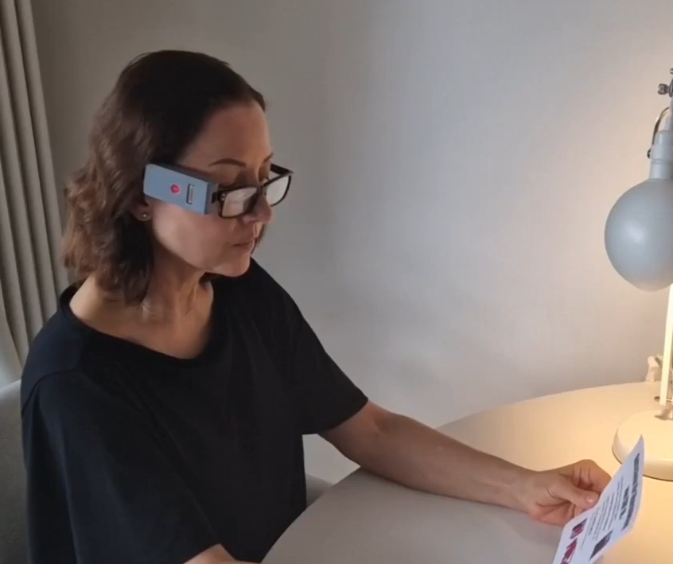
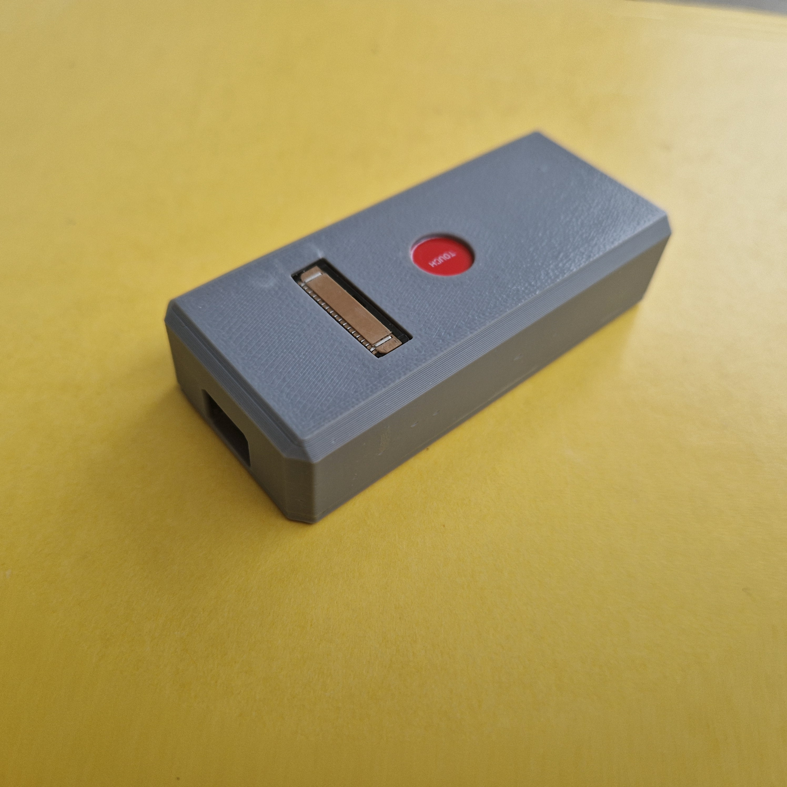
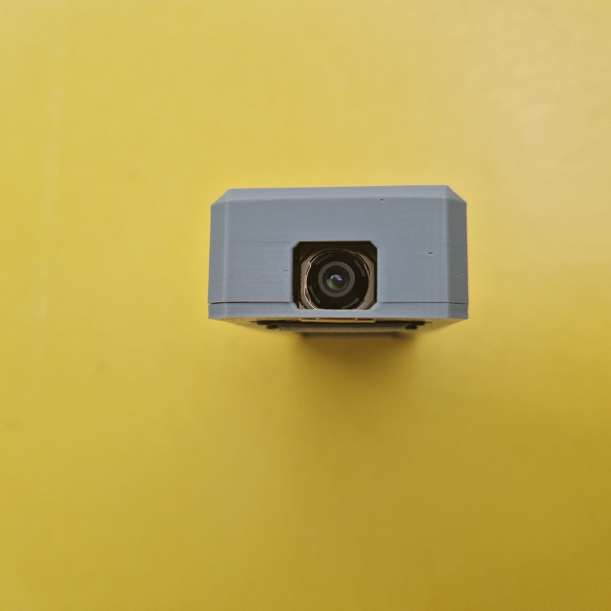
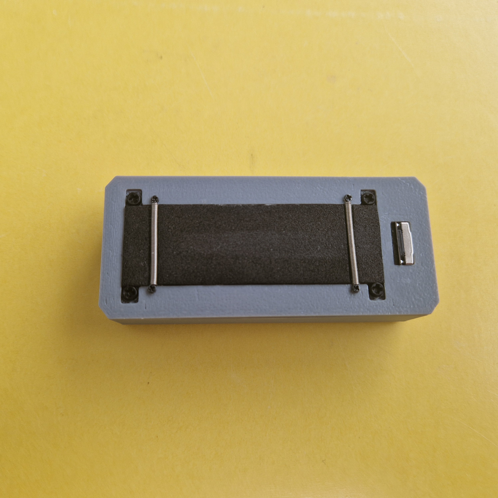
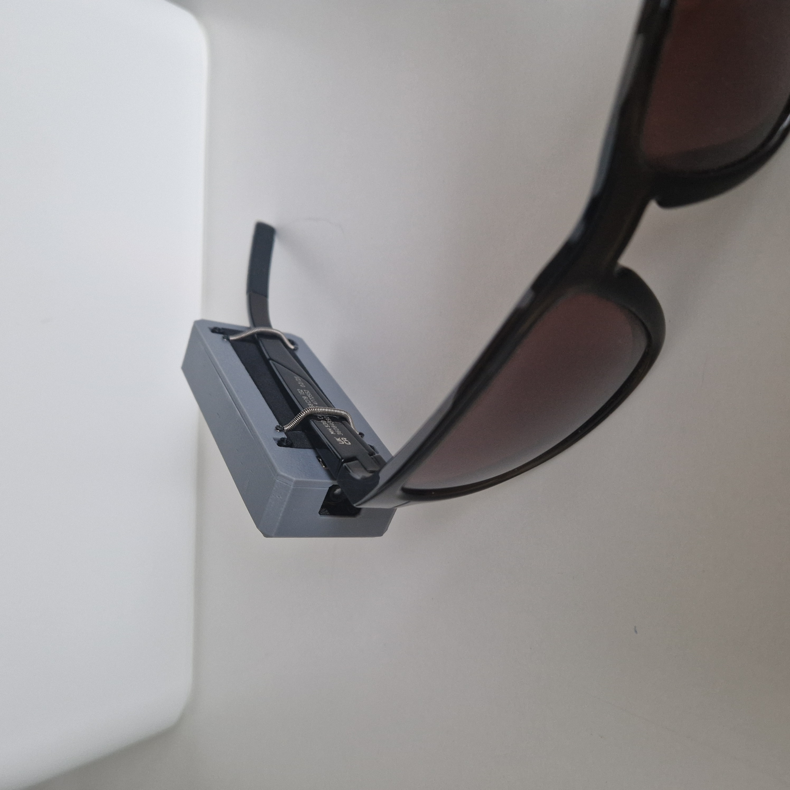
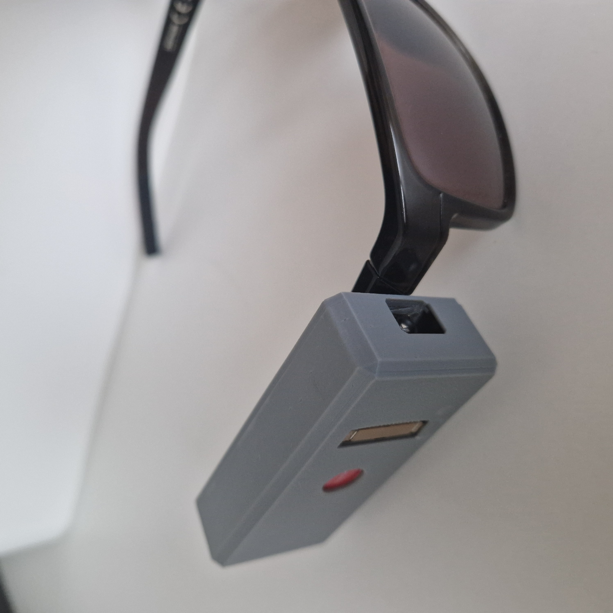

# Camera2Speech
<br>

<br>
A wearable Raspberry Pi Zero 2 based OCR-to-speech device inspired by OrCam MyEye 2.

## Goal

The goal of this project is to convert printed text into speech using a compact wearable setup.

Pipeline:

```text
Camera -> Image Processing -> OCR -> Text -> Speech -> Audio Output
```

Reference commercial product:

* OrCam MyEye 2

## Comparison with other systems

| Criterion | **This device** | **OrCam MyEye** | **Seeing AI / Envision AI** | **Ray-Ban Meta** |
|---|---|---|---|---|
| **Price** | 🟢 **~€100** in components | 🔴 **Several thousand €** | 🟢 **Free** | 🟡 **~€419–499** |
| **Works without a smartphone** | 🟢 **Yes** - For online mode however Internet connection is still needed, which makes the Smartphone best candidate now to provide the Hotspot. | 🟢 **Yes** | 🔴 **No** | 🔴 **No** – smartphone + app required |
| **Simple physical operation** | 🟢 **Yes** – touch + gestures, designed specifically for this purpose | 🟢 **Yes** – designed as an assistive device | 🔴 Smartphone touchscreen, apps, notifications, OS interaction, etc. | 🟢 Voice/glasses controls, but smartphone still required |
| **OCR / reading text aloud** | 🟢 **Yes** | 🟢 **Yes** | 🟢 **Yes** | 🟢 **Yes** |
| **Scene description / AI** | 🟢 **Yes** – optional online processing with OpenAI API. The online mode increases significantly the abilities of the device: it can additionally recognize objects, translate texts and describe scenes. | 🟡 Limited depending on model | 🟢 **Yes** | 🟢 **Yes** |
| **Offline operation** | 🟢 **Yes** – basic OCR + TTS run locally | 🟢 **Yes** – essential functions work locally | 🟡/🔴 Partially; some functions require Internet access | 🔴 AI functions largely depend on online services |
| **Can still read text without Internet** | 🟢 **Yes** | 🟢 **Yes** | 🟡 Depends on app/function | 🔴/🟡 Limited |
| **Can be used with the user's own glasses** | 🟢 **Yes** – separate wearable device | 🟢 **Yes** – attaches to glasses | 🟢 **Yes** – smartphone based | 🟡 Ray-Ban is itself the eyewear; prescription lenses are available |
| **Languages can be extended** | 🟢 **Yes** – OCR/TTS components can be replaced or added | 🔴/🟡 Depends on OrCam firmware/licensing | 🟢 Many languages | 🟡 Depends on Meta |
| **Risk of manufacturer removing/changing features** | 🟢 **Very low** | 🔴 Proprietary system | 🔴 Proprietary apps/cloud services | 🔴 Proprietary ecosystem |
| **Open Source / maintainability** | 🟢 **Yes** – Open Source / GPL; software can be maintained, modified and individual components replaced | 🔴 **No** | 🔴 **No** | 🔴 **No** |
| **Privacy / sensitive documents** | 🟢 **Offline processing available** - in online mode however the images are uploaded to OpenAI servers for processing. | 🟢 Offline processing available | 🟡/🔴 Cloud functions involved | 🔴 Cloud/Meta ecosystem |
| **Product maturity** | 🔴 **Prototype** | 🟢 **Commercial assistive device** | 🟢 **Established apps** | 🟢 **Commercial product** |
| **Designed specifically for blind users** | 🟢 **Yes** | 🟢 **Yes** | 🟢 **Yes** | 🔴 Originally a general-purpose smart/media glasses product |
| **Operating time** | 🟢 **~4–8 hours**, depending on usage intensity | 🟡 1.5-2 hours if intensively used | 🟢 Limited mainly by smartphone battery | 🟡 Depends on usage |

## Live examples:

**In the following videos - all the sounds (except the background music) are recorded directly from the device - this is exactly what the user listens in his/her earphones.**

### Read offline<br>
The offline mode may be used only for text recognition now - no other detection is possible (objects, faces, etc). The so called TTS (text-to-speach) processing is running locally on the device. In this case no online connection is needed.
<br>
<video controls width="1080" src="images/read-offline.mp4"></video>
<br>

### Read online<br>
In the online mode the device connects over internet to the OpenAI API to upload the images for their processing on the OpenAI server. The returned information includes:
1. Short description of the scene and
2. Exact (translation) of the recognized text.
<br>
<video controls width="1080" src="images/read-online.mp4"></video>
<br>

### Read and translate<br>
In this demo video - the user is opening English internet page - the returned result is translation into system language (German in this case).
<br>
<video controls width="1080" src="images/read-and-translate.mp4"></video>
<br>

### Objects recognition<br>
If there is no meaningful text to read - the online mode can still return valuable information about the world with short description of the scene.
<br>
<video controls width="1080" src="images/object-recognition.mp4"></video>
<br>

### Change language
In the current implementation only English and German languages are available.
<br>
<video controls width="1080" src="images/change-language.mp4"></video>
<br>
---

## Overall size (L x H x W): 80 x 35 x 18 mm, weight: 50 mg

<br>
<br>
<br>
<br>
<br>

## Hardware

### Processing Unit

* Raspberry Pi Zero 2

### Camera

* MIPI CSI Raspberry Pi Camera Module 3, Kameramodul 3 12MP
* Resolution: 4608 × 2592 Pixel

### Audio Output

* Connected external earphone over bluetooth

### Power

* Waveshare UPS HAT C für Raspberry Pi Zero, I2C Batterieüberwachung, Li-po, 1000 mAh
* roughly estimated duration 4-8 hours (depending on the load)
* https://www.ebay.de/itm/127800499172

### Sensors

* Axel+Gyro MPU6050
* Touch sensor

The two sensors provide the interactivity (interface) with the user: device initialization (waking up) is activated by a touch sensor. Nod is agreeing with menu option, shake is disagreeing - which moves to the next menu option:
<br>


Touch sensor:<br>
<video controls width="600" src="images/touch-sensor.mp4"></video>

---

[Raspberry Pi Setup](Raspberry_Pi_Setup.md)

---

### Example of a taken photo (RGB)


### Image converted to gray, cropped, contrast enhanced, horizon correction, tesseract detected text regions):


* Piper wav demo: <br>
```
echo "Alice thought she might as well go back, and see how the game was going on, as she heard the Queen’s voice in the distance, screaming with passion. She had already heard her sentence three of the players to be executed for having missed their turns, and she did not like the look of things at all, as the game was in such confusion that she never knew whether it was her turn or not. So she went in search of her hedgehog." | piper --model en_US-amy-low.onnx --output_file piper-example.wav
```
<audio controls src="sounds/piper-example.wav"></audio>

* RHVoice wav demo: <br>
```
echo "Alice thought she might as well go back, and see how the game was going on, as she heard the Queen’s voice in the distance, screaming with passion. She had already heard her sentence three of the players to be executed for having missed their turns, and she did not like the look of things at all, as the game was in such confusion that she never knew whether it was her turn or not. So she went in search of her hedgehog." | RHVoice-test -p alan -o - | ffmpeg -f wav -i pipe:0 -af "volume=10dB" sounds/rhvoice-example.wav
```
<audio controls src="sounds/rhvoice-example.wav"></audio>

* mimic-1 wav demo: <br>

```
echo "Alice thought she might as well go back, and see how the game was going on, as she heard the Queen’s voice in the distance, screaming with passion. She had already heard her sentence three of the players to be executed for having missed their turns, and she did not like the look of things at all, as the game was in such confusion that she never knew whether it was her turn or not. So she went in search of her hedgehog." | piper --model en_US-amy-low.onnx --output_file piper-example.wav
```
<audio controls src="sounds/mimic-1-example.wav"></audio>

* nanotts (svox) wav demo: <br>

```
echo "Alice thought she might as well go back, and see how the game was going on, as she heard the Queen’s voice in the distance, screaming with passion. She had already heard her sentence three of the players to be executed for having missed their turns, and she did not like the look of things at all, as the game was in such confusion that she never knew whether it was her turn or not. So she went in search of her hedgehog." | piper --model en_US-amy-low.onnx --output_file piper-example.wav
```
<audio controls src="sounds/nanotts-example.wav"></audio>

**For raspberry pi Zero 2 piper is reaching the HW limits and causes large delays.**

<br>


First version of the device:

[Version 1](version-1.md)