# Camera2Speech

A wearable Raspberry Pi Zero 2 based OCR-to-speech device inspired by OrCam MyEye 2.

## Goal

The goal of this project is to convert printed text into speech using a compact wearable setup.

Pipeline:

```text
Camera -> Image Processing -> OCR -> Text -> Speech -> Audio Output
```

Reference commercial product:

* OrCam MyEye 2

---

## Hardware

### Processing Unit

* Raspberry Pi Zero 2

### Camera

* MIPI CSI Raspberry Pi Camera Module 3, Kameramodul 3 12MP
* Resolution: 4608 × 2592 Pixel

### Audio Output

* Connected external earphone over bluetooth

### Power

* Waveshare UPS HAT C für Raspberry Pi Zero, I2C Batterieüberwachung, Li-po, 1000 mAh
* roughly estimated duration 4-8 hours (depending on the load)
* https://www.ebay.de/itm/127800499172

### Sensors

* Axel+Gyro MPU6050
* Touch sensor

The two sensors provide the interactivity (interface) with the user: device initialization (waking up) is activated by a touch sensor. Nod is agreeing with menu option, shake is disagreeing - which moves to the next menu option:
<br>
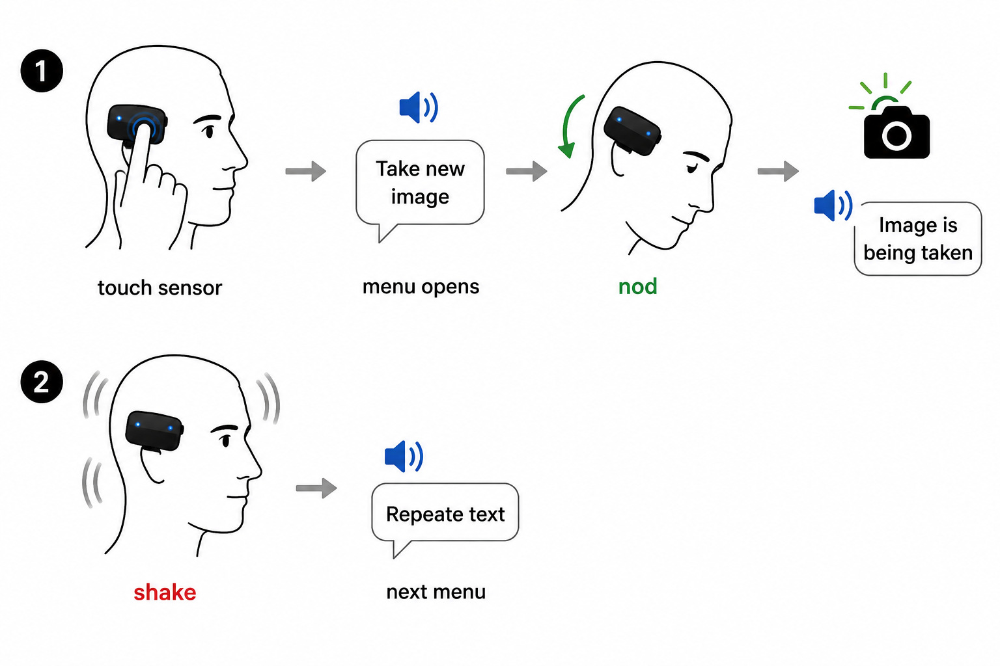

Touch sensor:<br>

Touch Sensor: [▶ Watch](./images/touch-sensor.mp4)

---

[Raspberry Pi Setup](Raspberry_Pi_Setup.md)

---

## Software

### Operating System

* Raspberry Pi OS Lite 64 bit

---

## Processing Pipeline

```text
USB Camera
    ->
fswebcam
    ->
ffmpeg
    ->
tesseract
    ->
RHVoice / piper
    ->
aplay
```

### Image Acquisition

```bash
rpicam-still -n --immediate --width 2592 --height 1944 -o img.jpg
```

### Image Preprocessing

Examples:

```bash
ffmpeg -y -i img.jpg -vf "format=gray,normalize" gray.jpg
```

or

```bash
ffmpeg -y -i img.jpg -vf "format=gray,histeq" gray.jpg
```

### OCR

```bash
tesseract gray.jpg output -l eng
```

### Text To Speech

```bash
cat output.txt | RHVoice-test -p alan
```

### Audio Playback

```bash
aplay
```

---

## Cam2Speech.py

Current implementation:

* waits for user trigger
* captures image
* preprocesses image
* performs OCR
* converts text to speech
* plays speech through headphone jack


### Automatic Script Start
TODO: change to running the python Cam2Speech.py on start

The script starts automatically after boot.

---

### Typical CPU consumption.

Idle (600 MHz)

<pre>
pi@raspberrypi:~ $ mpstat -P ALL 1
Linux 6.12.93+rpt-rpi-v8 (raspberrypi)  24.07.2026      _aarch64_       (4 CPU)

11:36:30     CPU    %usr   %nice    %sys %iowait    %irq   %soft  %steal  %guest  %gnice   %idle
11:36:31     all    0,00    0,00    0,00    0,00    0,00    0,00    0,00    0,00    0,00  100,00
11:36:31       0    0,00    0,00    0,00    0,00    0,00    0,00    0,00    0,00    0,00  100,00
11:36:31       1    0,00    0,00    0,00    0,00    0,00    0,00    0,00    0,00    0,00  100,00
11:36:31       2    0,00    0,00    0,00    0,00    0,00    0,00    0,00    0,00    0,00  100,00
11:36:31       3    0,00    0,00    0,00    0,00    0,00    0,00    0,00    0,00    0,00  100,00

11:36:31     CPU    %usr   %nice    %sys %iowait    %irq   %soft  %steal  %guest  %gnice   %idle
11:36:32     all    0,25    0,00    0,25    0,00    0,00    0,00    0,00    0,00    0,00   99,50
11:36:32       0    0,00    0,00    0,99    0,00    0,00    0,00    0,00    0,00    0,00   99,01
11:36:32       1    0,00    0,00    0,00    0,00    0,00    0,00    0,00    0,00    0,00  100,00
11:36:32       2    0,00    0,00    0,00    0,00    0,00    0,00    0,00    0,00    0,00  100,00
11:36:32       3    1,00    0,00    0,00    0,00    0,00    0,00    0,00    0,00    0,00   99,00

11:36:32     CPU    %usr   %nice    %sys %iowait    %irq   %soft  %steal  %guest  %gnice   %idle
11:36:33     all    0,00    0,00    0,00    0,00    0,00    0,00    0,00    0,00    0,00  100,00
11:36:33       0    0,00    0,00    0,00    0,00    0,00    0,00    0,00    0,00    0,00  100,00
11:36:33       1    0,00    0,00    0,00    0,00    0,00    0,00    0,00    0,00    0,00  100,00
11:36:33       2    0,00    0,00    0,00    0,00    0,00    0,00    0,00    0,00    0,00  100,00
11:36:33       3    0,00    0,00    0,00    0,00    0,00    0,00    0,00    0,00    0,00  100,00
</pre>

Full load (1GHz ffmpeg+tesseract)

<pre>
11:40:33     CPU    %usr   %nice    %sys %iowait    %irq   %soft  %steal  %guest  %gnice   %idle
11:40:34     all   24,87    0,00    0,50    1,01    0,00    0,00    0,00    0,00    0,00   73,62
11:40:34       0    1,04    0,00    1,04    0,00    0,00    0,00    0,00    0,00    0,00   97,92
11:40:34       1   96,04    0,00    0,00    3,96    0,00    0,00    0,00    0,00    0,00    0,00
11:40:34       2    0,00    0,00    0,00    0,00    0,00    0,00    0,00    0,00    0,00  100,00
11:40:34       3    0,98    0,00    0,98    0,00    0,00    0,00    0,00    0,00    0,00   98,04

11:40:34     CPU    %usr   %nice    %sys %iowait    %irq   %soft  %steal  %guest  %gnice   %idle
11:40:35     all   49,50    0,00    1,25    0,00    0,00    0,00    0,00    0,00    0,00   49,25
11:40:35       0   32,00    0,00    4,00    0,00    0,00    0,00    0,00    0,00    0,00   64,00
11:40:35       1   99,00    0,00    1,00    0,00    0,00    0,00    0,00    0,00    0,00    0,00
11:40:35       2   33,66    0,00    0,00    0,00    0,00    0,00    0,00    0,00    0,00   66,34
11:40:35       3   33,33    0,00    0,00    0,00    0,00    0,00    0,00    0,00    0,00   66,67

11:40:35     CPU    %usr   %nice    %sys %iowait    %irq   %soft  %steal  %guest  %gnice   %idle
11:40:36     all   45,06    0,00    1,01    0,25    0,00    0,00    0,00    0,00    0,00   53,67
11:40:36       0   26,80    0,00    2,06    0,00    0,00    0,00    0,00    0,00    0,00   71,13
11:40:36       1   99,00    0,00    1,00    0,00    0,00    0,00    0,00    0,00    0,00    0,00
11:40:36       2   26,53    0,00    0,00    1,02    0,00    0,00    0,00    0,00    0,00   72,45
11:40:36       3   27,00    0,00    1,00    0,00    0,00    0,00    0,00    0,00    0,00   72,00
</pre>

Read aloud (1GH RHVoice+aplay)
<pre>
11:42:48     CPU    %usr   %nice    %sys %iowait    %irq   %soft  %steal  %guest  %gnice   %idle
11:42:49     all    7,91    0,00    0,26    0,00    0,00    0,00    0,00    0,00    0,00   91,84
11:42:49       0    3,00    0,00    0,00    0,00    0,00    0,00    0,00    0,00    0,00   97,00
11:42:49       1    0,00    0,00    1,05    0,00    0,00    0,00    0,00    0,00    0,00   98,95
11:42:49       2   27,27    0,00    0,00    0,00    0,00    0,00    0,00    0,00    0,00   72,73
11:42:49       3    1,02    0,00    0,00    0,00    0,00    0,00    0,00    0,00    0,00   98,98

11:42:49     CPU    %usr   %nice    %sys %iowait    %irq   %soft  %steal  %guest  %gnice   %idle
11:42:50     all    5,04    0,00    3,27    0,00    0,00    0,00    0,00    0,00    0,00   91,69
11:42:50       0    3,92    0,00    3,92    0,00    0,00    0,00    0,00    0,00    0,00   92,16
11:42:50       1    3,03    0,00    5,05    0,00    0,00    0,00    0,00    0,00    0,00   91,92
11:42:50       2   11,11    0,00    3,03    0,00    0,00    0,00    0,00    0,00    0,00   85,86
11:42:50       3    2,06    0,00    1,03    0,00    0,00    0,00    0,00    0,00    0,00   96,91

11:42:50     CPU    %usr   %nice    %sys %iowait    %irq   %soft  %steal  %guest  %gnice   %idle
11:42:51     all   48,35    0,00    5,57    0,00    0,00    0,00    0,00    0,00    0,00   46,08
11:42:51       0   92,00    0,00    8,00    0,00    0,00    0,00    0,00    0,00    0,00    0,00
11:42:51       1    4,21    0,00    3,16    0,00    0,00    0,00    0,00    0,00    0,00   92,63
11:42:51       2    4,04    0,00    2,02    0,00    0,00    0,00    0,00    0,00    0,00   93,94
11:42:51       3   90,10    0,00    8,91    0,00    0,00    0,00    0,00    0,00    0,00    0,99
</pre>

Raspi switches itself from 600 MHz to 1 GHz when more CPU resources are required.

### Temperature

<pre>
Every 1,0s: vcgencmd measure_temp                           raspberrypi: Fri Jul 24 11:44:33 2026

temp=49.4'C
</pre>

### Useful utilities
```
# CPU temperature
vcgencmd measure_temp

# CPU frequency
cat /sys/devices/system/cpu/cpu0/cpufreq/scaling_cur_freq

# CPU governor
cat /sys/devices/system/cpu/cpu0/cpufreq/scaling_governor

# CPU utilization (all cores)
mpstat -P ALL 1

# CPU throttling
vcgencmd get_throttled

# Camera autosuspend
cat /sys/bus/usb/devices/1-1.2/power/runtime_status

# Enable camera autosuspend
echo auto | sudo tee /sys/bus/usb/devices/1-1.2/power/control

# Wi-Fi OFF
rfkill block wifi

# Bluetooth OFF
systemctl stop bluetooth

# HDMI OFF
vcgencmd display_power 0

# Running USB devices
lsusb

# GPIO interrupts (wait for button)
gpiomon --num-events=1 --edges=rising -c gpiochip0 17 22 27
```

### Example of a taken photo (RGB)
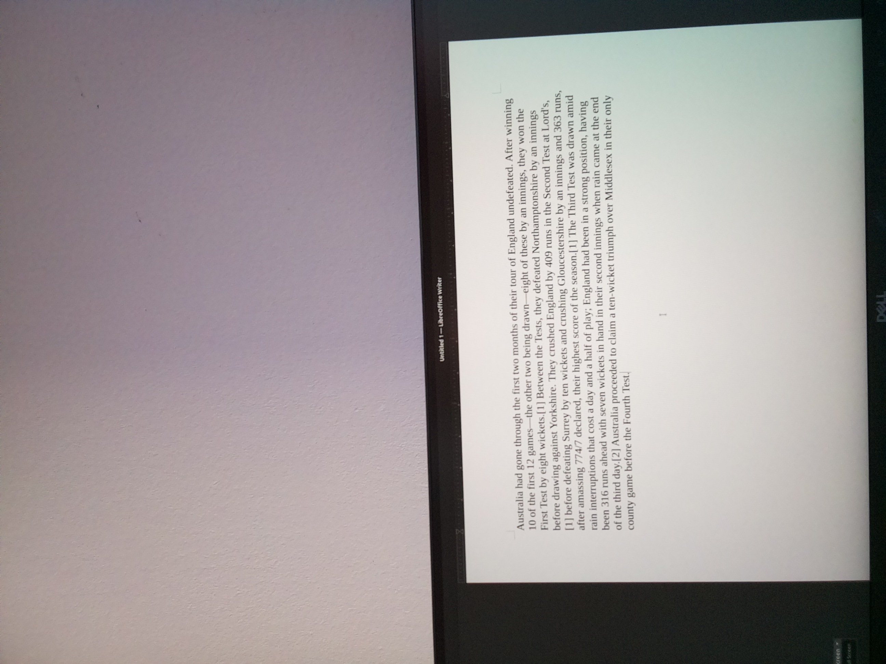

### Image converted to gray, cropped, contrast enhanced, horizon correction, tesseract detected text regions):
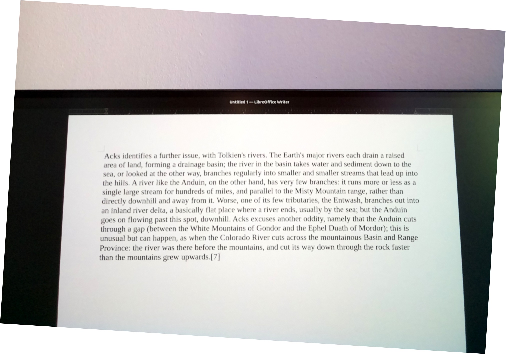

* RHVoice: <br>

[▶ Listen](./sounds/rhvoice-example.wav)

* Piper: <br>

[▶ Listen](./sounds/piper-example.wav)


**For raspberry pi 2 piper is reaching the HW limits and causes large delays.**

<br>


### Overall size and weight
Weight about 70 grams
Overall size: 80 x 35 x 17 mm (not counting screws heads)

### Battery duration
In idle mode (only raspi OS is running) the capacity reduces by ~10% within one hour making expected idle work 10 hours.
Intensive use of algos (tesseract) may reduce the time significantly (expedted ~2 hours).

### Pictures of the device

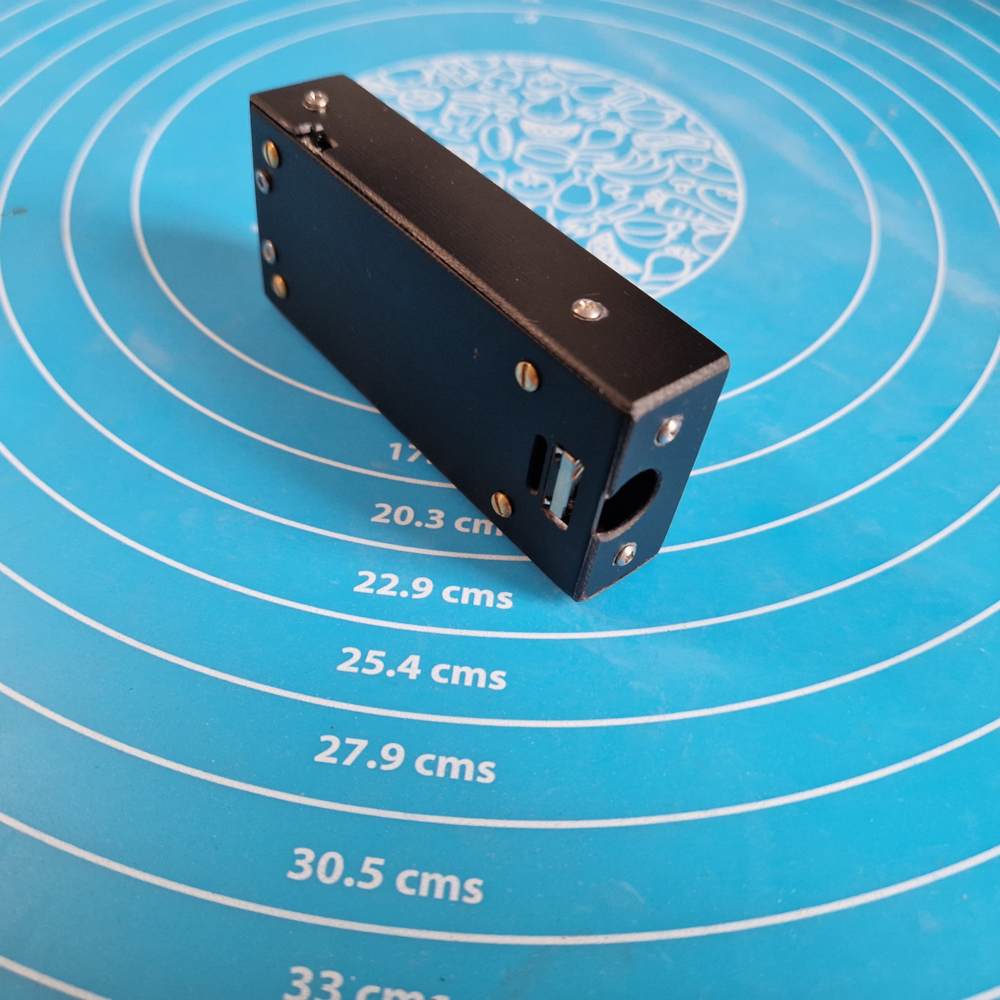
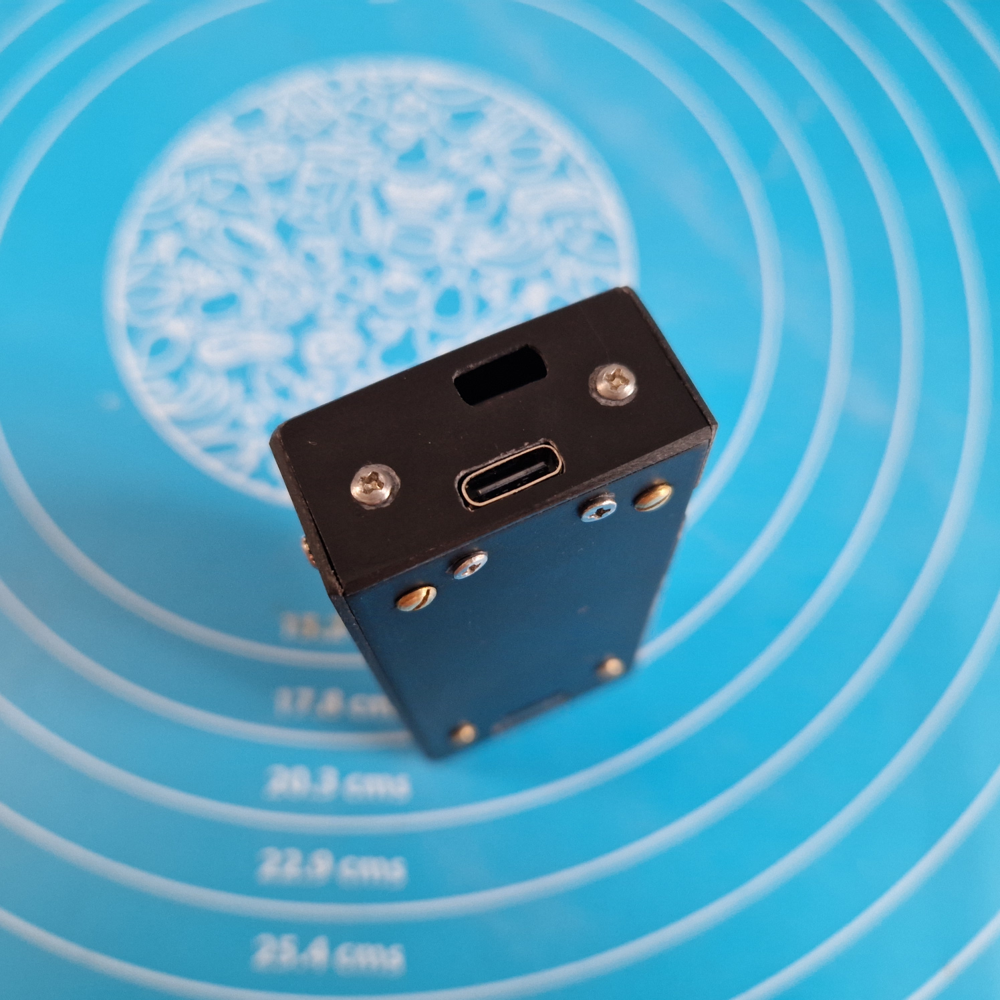
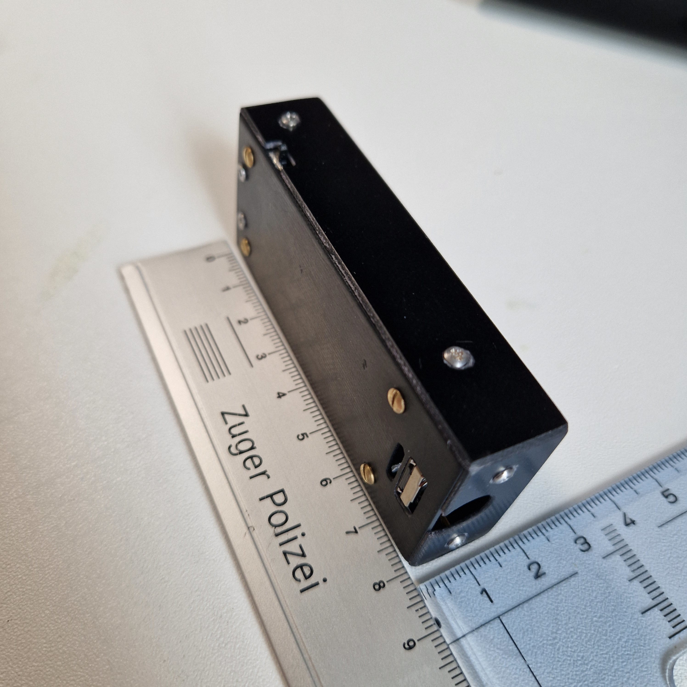
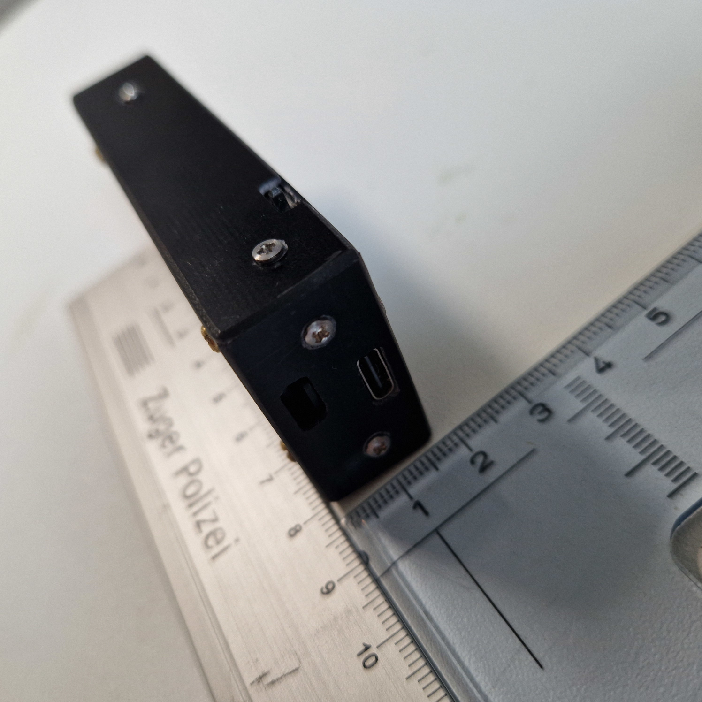
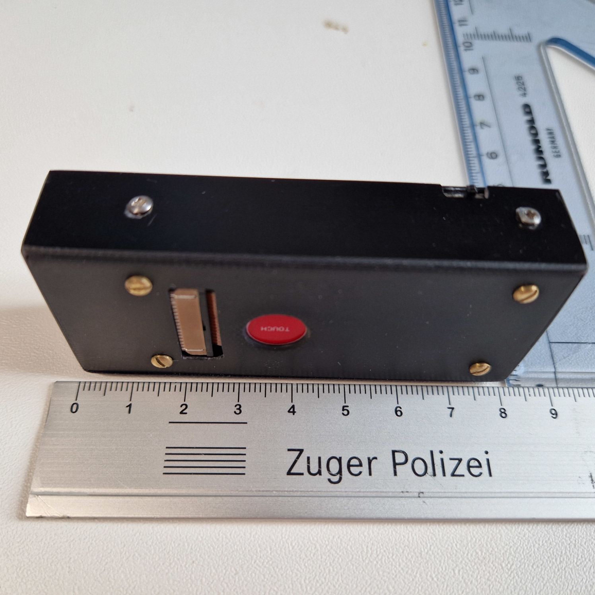
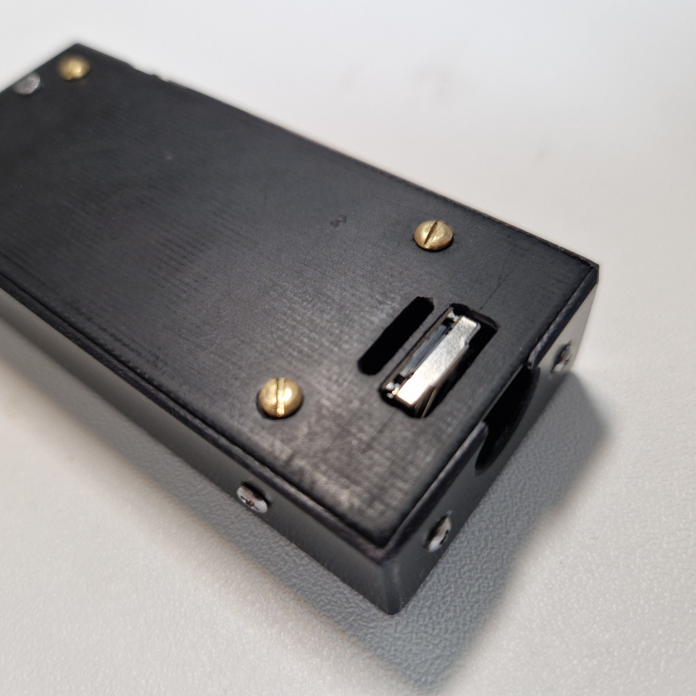
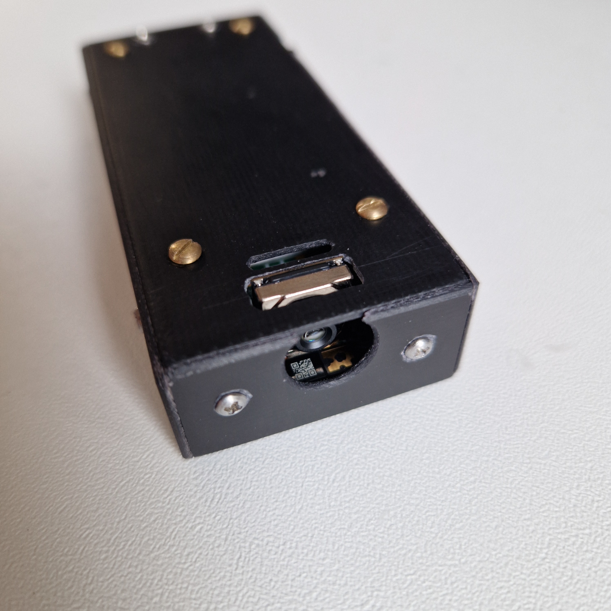
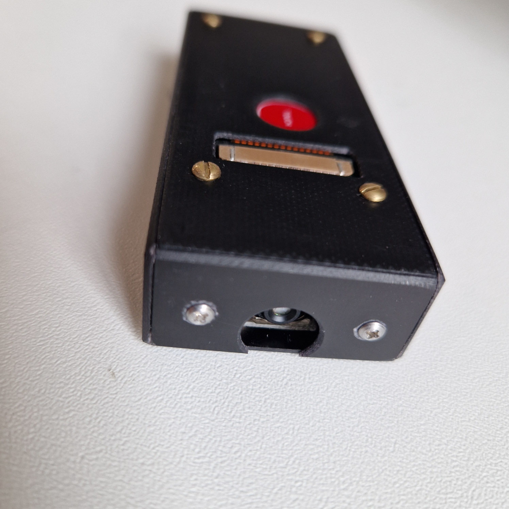