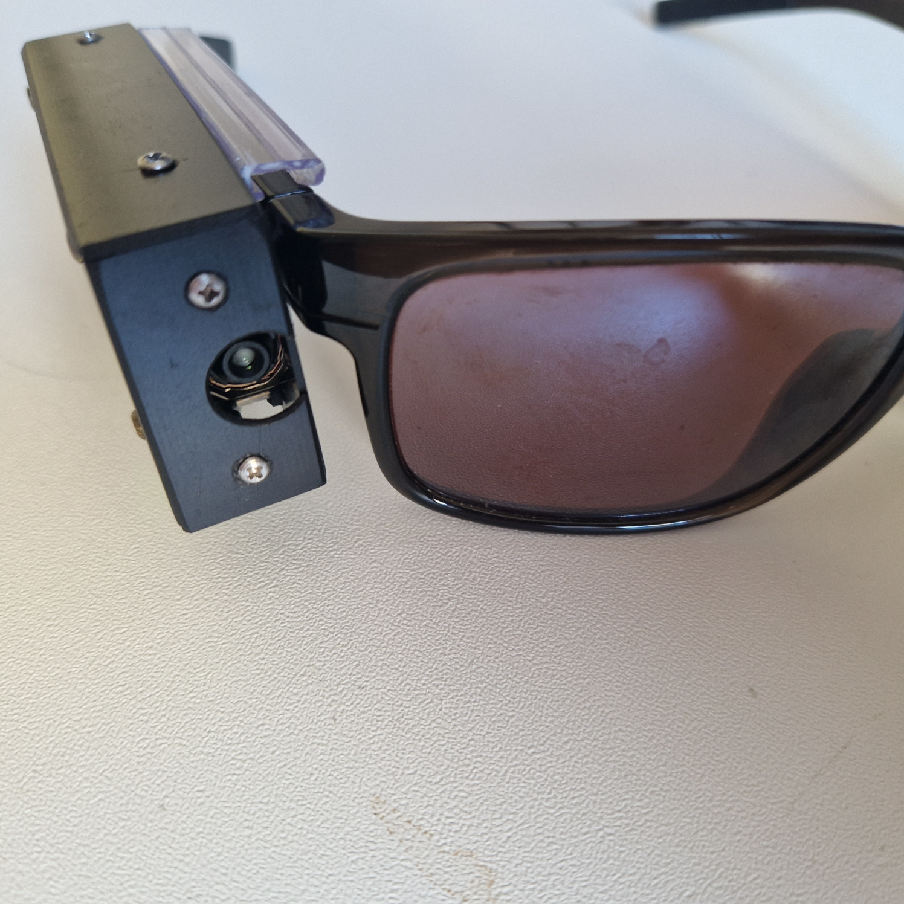
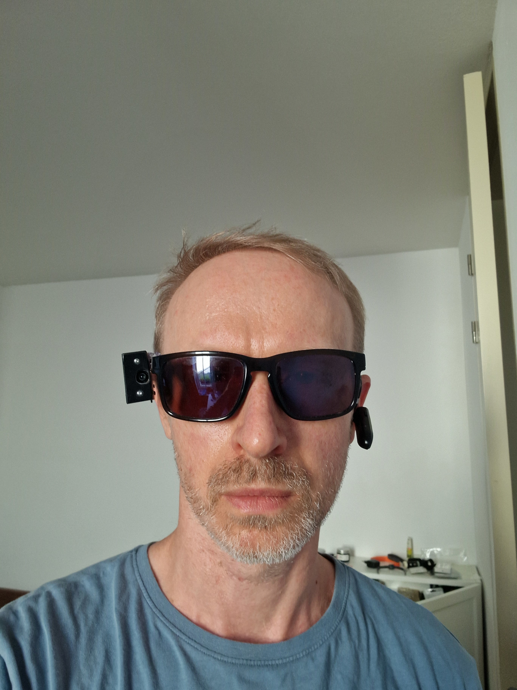
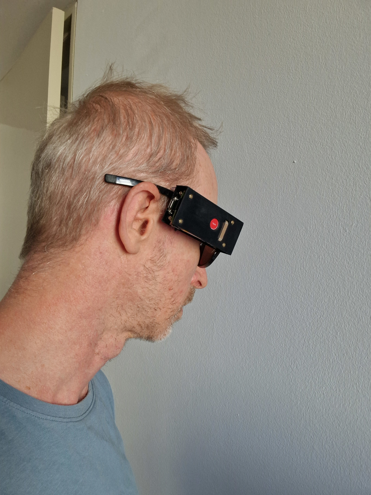
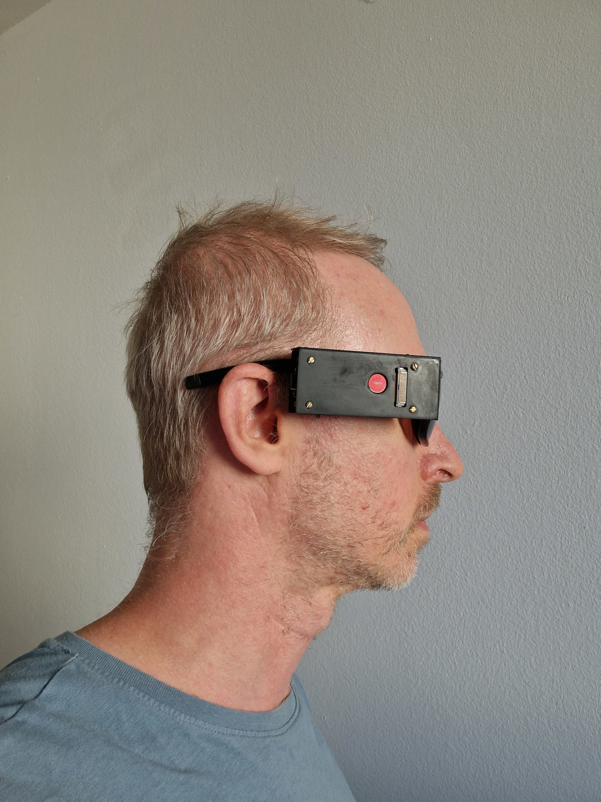

## Overall size and weight
Weight about 70 grams
Overall size: 80 x 35 x 17 mm (not counting screws heads)

## Battery duration
In idle mode (only raspi OS is running) the capacity reduces by ~10% within one hour making expected idle work 10 hours.
Intensive use of algos (tesseract) may reduce the time significantly (expedted ~2 hours).

## Pictures of the device

